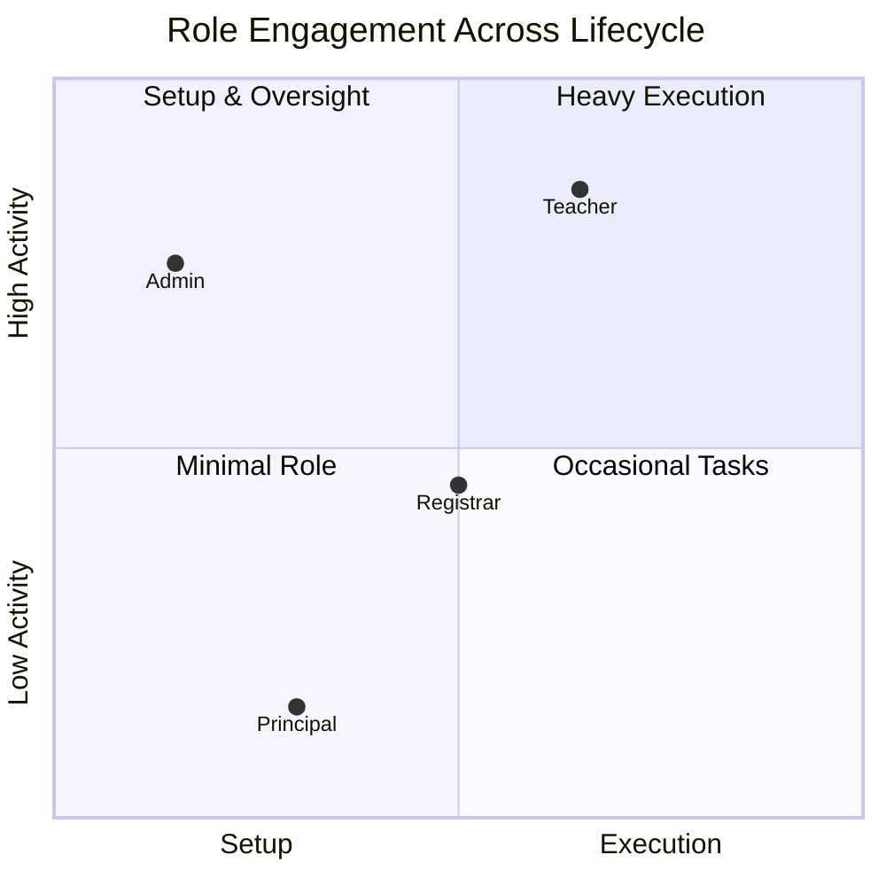

# Student Lifecycle Flowchart

This file uses Mermaid.js syntax. To view it:

- **GitHub** — renders natively (just view the file)
- **VS Code** — install [Markdown Preview Mermaid Support](https://marketplace.visualstudio.com/items?itemName=bierner.markdown-mermaid)
- **Online** — paste into https://mermaid.live/
- **CLI** — `npm install -D @mermaid-js/mermaid-cli && npx mmdc -i docs/STUDENT_LIFECYCLE_FLOW.md -o docs/flowchart.png`

---

## Full Lifecycle: Grade 7 → Graduation

```mermaid
flowchart TB
    %% ── STYLING ──
    classDef admin fill:#e0e7ff,stroke:#6366f1,stroke-width:1.5,color:#3730a3
    classDef teacher fill:#d1fae5,stroke:#10b981,stroke-width:1.5,color:#065f46
    classDef registrar fill:#fef3c7,stroke:#f59e0b,stroke-width:1.5,color:#92400e
    classDef system fill:#f3e8ff,stroke:#a855f7,stroke-width:1.5,color:#6b21a8
    classDef decision fill:#fff7ed,stroke:#f97316,stroke-width:1.5,color:#9a3412
    classDef terminal fill:#fce7f3,stroke:#ec4899,stroke-width:1.5,color:#831843

    %% ── START ──
    START([Start]) --> SETUP

    %% ══════════════════════════════════════════
    %% PHASE 0: Admin Setup
    %% ══════════════════════════════════════════
    subgraph SETUP_PHASE [Phase 0 — Admin Setup]
        SETUP[Admin creates School Year] :::admin
        --> SUBJECTS[Admin creates Subjects] :::admin
        --> SECTIONS[Admin creates Sections &amp; Types] :::admin
        --> USERS[Admin creates Teacher/Registrar accounts] :::admin
    end

    USERS --> ENROLL_START

    %% ══════════════════════════════════════════
    %% PHASE 1: Teacher Enrollment
    %% ══════════════════════════════════════════
    subgraph ENROLL_PHASE [Phase 1 — Teacher: Enrollment]
        ENROLL_START{Student type?} :::decision

        ENROLL_START -->|New Student G7| NEW_STU[Teacher fills New Student form<br/>LRN, Name, Grade Level, etc.] :::teacher
        ENROLL_START -->|Returning G8–G12| RET_STU[Teacher searches LRN<br/>→ details auto-populate] :::teacher
        ENROLL_START -->|Balik-Aral| BALIK[Teacher searches LRN<br/>→ creates fresh record] :::teacher

        NEW_STU --> STRAND{G11+?}
        STRAND -->|Yes| SELECT_STRAND[Teacher selects Strand/Track<br/>e.g. STEM, ABM, HUMSS, TVL] :::teacher
        STRAND -->|No| SKIP_STRAND

        SELECT_STRAND --> REQUIREMENTS
        SKIP_STRAND --> REQUIREMENTS
        RET_STU --> REQUIREMENTS
        BALIK --> REQUIREMENTS

        REQUIREMENTS[Teacher toggles<br/>submitted requirements] :::teacher
        --> ENROLL[Teacher clicks ENROLL<br/><strong>No section selected</strong>] :::teacher
        --> SYSTEM_ENROLL[System creates enrollment<br/><code>section_id = NULL</code><br/>status = 'enrolled'] :::system
        --> PENDING[Student appears as<br/><strong>"Pending Section"</strong>] :::system
    end

    PENDING --> REG_PHASE

    %% ══════════════════════════════════════════
    %% PHASE 2: Registrar Section Assignment
    %% ══════════════════════════════════════════
    subgraph REG_PHASE [Phase 2 — Registrar: Section Assignment]
        REG_VIEW[Registrar opens<br/>Section Assignment page] :::registrar
        --> QUEUE[Sees Pending Section Queue<br/>with all unassigned students] :::registrar

        QUEUE --> ASSIGN_METHOD{Assignment method?} :::decision

        ASSIGN_METHOD -->|Manual| MANUAL[Pick student →<br/>select target section] :::registrar
        ASSIGN_METHOD -->|Random| RANDOM[Auto-distribute<br/>across available sections] :::registrar
        ASSIGN_METHOD -->|Placement| PLACEMENT[Assign by exam scores<br/>STE / SPFL /SPJ] :::registrar
        ASSIGN_METHOD -->|Carryover| CARRYOVER[Carry G11 strand<br/>to G12 section] :::registrar

        MANUAL --> ASSIGNED
        RANDOM --> ASSIGNED
        PLACEMENT --> ASSIGNED
        CARRYOVER --> ASSIGNED

        ASSIGNED[System updates<br/><code>section_id</code> on enrollment] :::system
        --> CONFIRM[Student now visible<br/>in assigned section] :::system
    end

    CONFIRM --> GRADE_PHASE

    %% ══════════════════════════════════════════
    %% PHASE 3: Teacher Grade Encoding
    %% ══════════════════════════════════════════
    subgraph GRADE_PHASE [Phase 3 — Teacher: Grade Encoding]
        TEACH_GRADE[Teacher opens<br/>My Students or Grade Management] :::teacher
        --> SELECT_CLASS[Selects section &amp; student] :::teacher
        --> ENTER_GRADES[Enters Q1–Q4 grades<br/>for each of 12 subjects] :::teacher
        --> LOCK[Teacher locks grades<br/>per subject] :::teacher
        --> FORMS[Teacher generates School Forms<br/>SF1 · SF5 · SF9 · SF10] :::teacher

        FORMS --> YEAR_END{End of school year?} :::decision
        YEAR_END -->|Not yet| TEACH_GRADE
        YEAR_END -->|Yes| PROMOTE_CHECK
    end

    PROMOTE_CHECK --> PROMOTE_PHASE

    %% ══════════════════════════════════════════
    %% PHASE 4: Promotion / Graduation
    %% ══════════════════════════════════════════
    subgraph PROMOTE_PHASE [Phase 4 — Teacher: Promotion / Graduation]
        GRADE12{Grade level?} :::decision

        GRADE12 -->|G7–G11| PROMOTE[Teacher runs Bulk Promotion<br/>→ creates enrollment in next SY<br/>→ updates student grade_level] :::teacher
        GRADE12 -->|G12| COMPLETER[Teacher clicks<br/><strong>Mark as Completers</strong>] :::teacher

        PROMOTE --> RET_CHECK{General Average<br/>&gt;= 75?} :::decision
        RET_CHECK -->|Yes| PASS[Promoted to next grade] :::system
        RET_CHECK -->|No| RETAIN[Retained —<br/>stays in same grade] :::system

        PASS --> NEXT_YEAR
        RETAIN --> NEXT_YEAR

        COMPLETER --> GRAD_SYS[System updates:<br/>enrollment → 'completed'<br/>student → 'graduated'] :::system
        --> GRAD_DONE([🎓 Graduated!]) :::terminal

        NEXT_YEAR[Registrar advances to<br/>next School Year] :::registrar
    end

    NEXT_YEAR --> REG_MONITOR

    %% ══════════════════════════════════════════
    %% PHASE 5: Registrar Monitoring
    %% ══════════════════════════════════════════
    subgraph REG_MONITOR_PHASE [Phase 5 — Registrar: Monitoring]
        REG_DASH[Registrar Dashboard:<br/>enrollment stats, charts] :::registrar
        REG_REPORT[Enrollment Report:<br/>export CSV / Excel / PDF] :::registrar
        REG_CERT[Generate Certificates:<br/>Enrollment, Good Moral] :::registrar
        REG_ATRISK[At-Risk Students:<br/>read-only view] :::registrar
    end

    REG_DASH --> REG_REPORT --> REG_CERT --> REG_ATRISK

    REG_ATRISK --> PRIN_PHASE

    %% ══════════════════════════════════════════
    %% PHASE 6: Principal View
    %% ══════════════════════════════════════════
    subgraph PRIN_PHASE [Phase 6 — Principal: View Only]
        PRIN_DASH[Principal Dashboard:<br/>school-wide overview] :::admin
        PRIN_ENROLL[Enrollment Figures<br/>per grade, gender breakdown] :::admin
        PRIN_PROGRESS[Grade Progress<br/>submission completion] :::admin
        PRIN_PROMO[Promotion Stats] :::admin
    end

    PRIN_DASH --> PRIN_ENROLL --> PRIN_PROGRESS --> PRIN_PROMO

    %% ── LOOP BACK ──
    PRIN_PROMO --> NEXT_CYCLE{Next School Year?} :::decision
    NEXT_CYCLE -->|Yes — repeat| ENROLL_START
    NEXT_CYCLE -->|No — end| FINISH([End]) :::terminal
```

---

## Simplified Yearly Cycle (Role View)

```mermaid
flowchart LR
    %% ── STYLING ──
    classDef admin fill:#e0e7ff,stroke:#6366f1,color:#3730a3
    classDef teacher fill:#d1fae5,stroke:#10b981,color:#065f46
    classDef registrar fill:#fef3c7,stroke:#f59e0b,color:#92400e
    classDef system fill:#f3e8ff,stroke:#a855f7,color:#6b21a8

    A[👤 Admin<br/>Setup] :::admin --> B[🧑‍🏫 Teacher<br/>Enroll Student<br/><small>no section</small>] :::teacher
    B --> C[📋 Registrar<br/>Assign Section] :::registrar
    C --> D[🧑‍🏫 Teacher<br/>Encode Grades<br/>Q1–Q4] :::teacher
    D --> E[🧑‍🏫 Teacher<br/>Lock Grades] :::teacher
    E --> F[🧑‍🏫 Teacher<br/>Generate Forms<br/>SF1 · SF5 · SF9 · SF10] :::teacher
    F --> G[⚙️ System<br/>Bulk Promotion<br/>→ next grade] :::system
    G -->|Repeat for G8–G12| B
    G --> H[🎓 Grade 12<br/>→ Graduation] :::system
```

---

## Role Responsibility Matrix



---

## Notes

- **Teacher** is the most active role — enrollment, grading, forms, and promotion all sit here
- **Registrar** bridges enrollment and section assignment, then monitors throughout the year
- **Admin** does upfront setup, then has minimal daily involvement
- **Principal** is view-only across all dashboards
